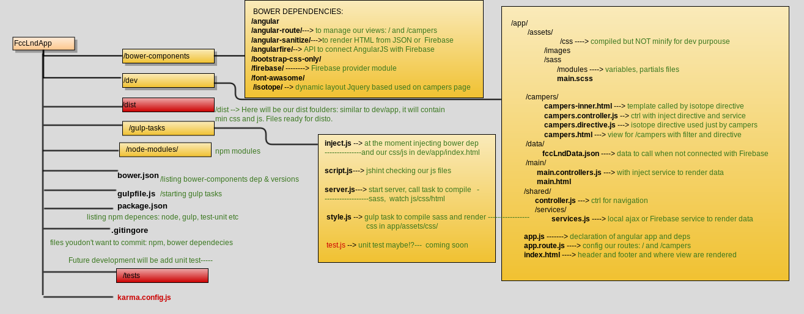

# FCC London Campers Web App

[](https://gitter.im/FreeCodeCampLondon/FCCLND?utm_source=badge&utm_medium=badge&utm_campaign=pr-badge&utm_content=badge)

This is a **collaborative**, **beginner-friendly** project to build a portal for those learning to code with Free Code Camp in London, UK. This is to help facilitate coding sessions and provide a collaborative learning experience to fellow Campers.

## Aims

We want to fulfil the following _user stories_ which solve some common problems when learning to code:
+ as a Camper I want to:
  - meet other Campers, make new friends and build a learning support group within my local area
  - find other Campers to pair program with who are local and at the same level on the Free Code Camp Curriculum
  - find fellow Campers for ad-hoc coding sessions in my local area
+ as a coding session organiser I want to:
  - let other Campers know about the next coding session
  - know what level attendees are at so that I can tailor the session accordingly and group campers accordingly

We do not want to:
+ create a leaderboard: while for some this may add a fun gamification aspect it could discourage others to see how they compare in 'ranking'.
+ create a board for recruiters. Once we have a backend we can have more control over what data is public to discourage this. This is a learning tool not a job board. :smile:

## Keeping it Beginner Friendly

We want to encourage contributions to this project from Campers in the London area no matter their coding level.

In order to achieve this we will:
+ use the technologies currently taught in the FCC curriculum, i.e.:
  - ES5 JavaScript
  - Node
  - Express
  - SASS
  - MongoDB
+ break down larger issues into smaller parts so that beginners can make small changes
+ hold demo sessions at our monthly meet-ups

## [How to Contribute](CONTRIBUTING.md)
## [Add yourself to the Campers page](dev/app/data/README.md)

## Quick Start

Run these sequentially in the Terminal
```shell
  git clone https://github.com/FreeCodeCampLondon/FCCLND.git
  cd FCCLND
  npm install --global gulp-cli browser-sync
  npm install
```

Start developing with live-reload:
```shell
gulp
```

## Technologies

* [Gulp](http://gulpjs.com) as the task runner
* [Bootstrap](http://getbootstrap.com) as the front-end
* [Sass](http://sass-lang.com) for syntactically awesome custom styles
* [Font Awesome](http://fontawesome.io) for glyph icons
* [Browsersync](https://browsersync.io) so that you can live preview changes as you develop
* [Angular 1](https://angularjs.org) for the MVC framework
* [Isotope](http://isotope.metafizzy.co) for filtering the Campers and displaying in a Masonry Layout
* [Firebase](http://firebase.com) for the Database (Static JSON)

## App Structure

Ideas taken from:

* [Scotch.io Angularjs Best practices directory structure](https://scotch.io/tutorials/angularjs-best-practices-directory-structure)
* [Blog Rangle: Angular Gulp Best Practices](http://blog.rangle.io/angular-gulp-bestpractices/)


